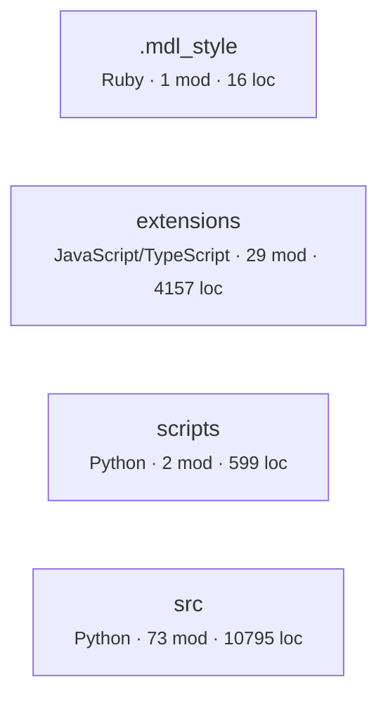
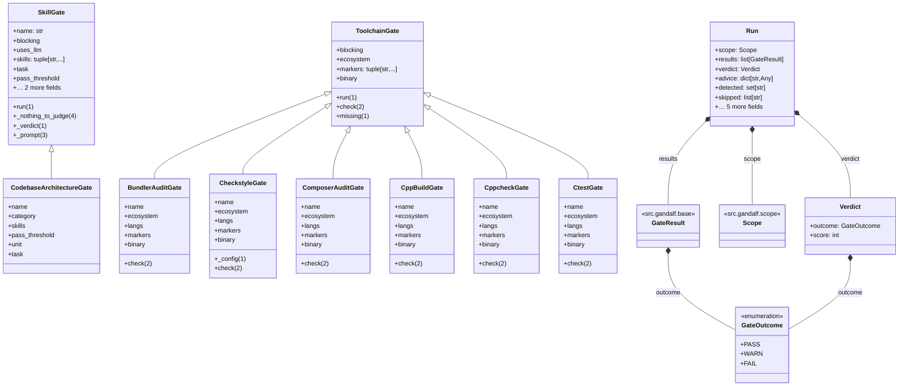
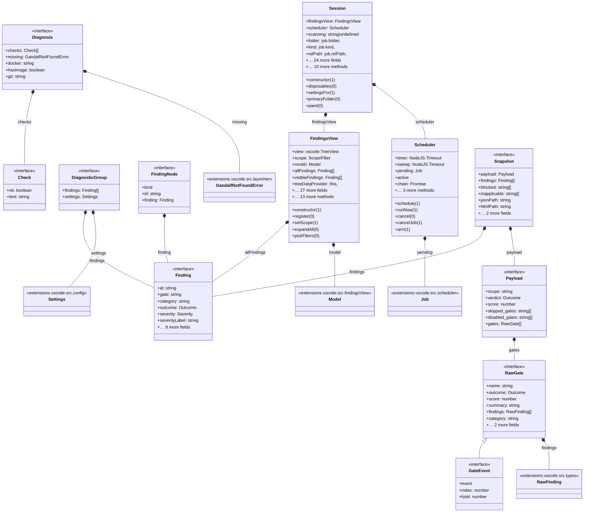

# Architecture map

Derived from source by automap 2.0. Every line is computed, not written. Regenerate with `automap map`; do not edit by hand.

## What this says about the system

Each item fired because a measurement crossed a threshold. The numbers and the evidence are from your code; the explanation is fixed text from a rule catalog, identical every time that rule fires on any repository. `automap rules` prints the catalog on its own so you can audit the claims before trusting them here. What none of it can tell you is why your team built it this way — that is what `automap adr` leaves blank.

| | count |
|---|---:|
| Serious | 1 |
| Worth attention | 1 |
| Minor | 3 |
| Notes | 1 |

### Serious · 1 component pair(s) are repeatedly changed in the same commit despite having no import between them.

**Why it matters.** This is coupling the import graph cannot see, and it is often the coupling that actually hurts. Two components that must change together are coupled through something — a wire format, a database column, a duplicated constant, an assumption — and because nothing links them in code, nothing warns the person who changes only one.

**What usually causes it.** A shared schema or protocol with no shared definition, copy-pasted logic that has to be kept in step, or a genuine feature that was split across a boundary in the wrong place.

**What to do.** Make the hidden contract explicit: one shared type, schema, or constant that both sides import, so the next change to it cannot silently miss a side. Where the split itself was wrong, moving the code together is cheaper than maintaining the coincidence.

<details><summary>Evidence</summary>

- `extensions` and `src` — 5 commits together, no import

</details>

<sub>`ARCH-COCHANGE` · Change over time</sub>

### Worth attention · 1 module(s) are more than 4× the median size (114 lines); the largest is 521 lines.

**Why it matters.** A file this far from the median is rarely one idea. It cannot be reviewed in one sitting, it produces merge conflicts between people working on unrelated things, and it hides its internal structure from every tool that works at file granularity — including this one, which sees it as a single node.

**What usually causes it.** Accretion. Each addition was small and reasonable, and no single commit was the one that made it too large.

**What to do.** Split along the lines its own imports suggest: the groups of functions that share dependencies are usually the natural modules. Do it before it becomes the file everyone avoids.

<details><summary>Evidence</summary>

- `src/gandalf/__main__.py` — 521 lines

</details>

<sub>`ARCH-GODFILE` · Size and shape</sub>

### Minor · 1 of 966 imports (0%) point at something this tool could not find on disk.

**Why it matters.** Every conclusion below is drawn from the edges that did resolve. Unresolved local imports mean real dependencies are missing from the graph, so cycles may go undetected and coupling is understated. A map with unknown holes is more dangerous than no map, because it invites confidence.

**What usually causes it.** Usually a source root, path alias, or monorepo package boundary that has not been declared. Occasionally generated code, or imports assembled at runtime from strings.

**What to do.** Add the missing `source_roots` or `aliases` to `.automap.json` and rerun until this is zero, or publish the graph as a lower bound and say so where it is published.

<details><summary>Evidence</summary>

- TypeScript: 1 unaccounted

</details>

<sub>`ARCH-COVERAGE` · Evidence quality</sub>

### Minor · 1 component(s) sit far from the balance between how abstract they are and how much depends on them.

**Why it matters.** Two bad corners exist. A component that is concrete and widely depended on is rigid: it cannot change without breaking its dependents, and it offers no seam to extend through. A component that is abstract and depended on by nothing is unused indirection: interfaces with one implementation and no callers.

**What usually causes it.** Rigidity comes from exposing concrete types across a boundary instead of an interface. Unused abstraction comes from designing for a second implementation that never arrived.

**What to do.** For the rigid ones, introduce an interface on the depended-on side and let dependents bind to that. For the unused abstractions, collapse the indirection until a second implementation actually exists.

<details><summary>Evidence</summary>

- `extensions` — abstractness 0.29, instability 0.0, distance 0.71

</details>

<sub>`ARCH-MAINSEQ` · Structure</sub>

### Minor · 42 modules over 30 lines are imported by nothing in this tree.

**Why it matters.** Unreferenced code still gets read, still gets updated during refactors, and still appears in searches. If it is genuinely unused it is a tax on every future reader. If it is used through a mechanism no static tool can see, that mechanism is exactly the thing worth writing down, because nobody will infer it.

**What usually causes it.** Entry points invoked by a runner or framework, plugins loaded by name, code kept 'just in case', or genuine leftovers.

**What to do.** Check each against how it is actually invoked. Delete what is dead; for the rest, record the invocation mechanism where a reader will find it.

<details><summary>Evidence</summary>

- `extensions/vscode/esbuild.mjs` — 61 lines
- `extensions/vscode/out/bench.js` — 491 lines
- `extensions/vscode/src/bench.ts` — 155 lines
- `extensions/vscode/src/extension.ts` — 46 lines
- `scripts/bench.py` — 385 lines
- `scripts/chart.py` — 214 lines
- `src/gandalf/gates/bandit.py` — 54 lines
- `src/gandalf/gates/build.py` — 56 lines

</details>

<sub>`ARCH-ORPHAN` · Size and shape</sub>

### Note · No layering declared, so layer checks are off.

**Why it matters.** Cycles and coupling are measurable without knowing your intent, but 'this dependency should not exist' is not. Declaring layers is how you tell the tool what the design is supposed to be, which turns a description into a check that can fail in CI.

**What usually causes it.** Most repositories never write the layering down; it lives in review comments and in whoever has been there longest.

**What to do.** Add a `layers` map to `.automap.json`, ordered top to bottom. Start with the layering you believe you have — the first run will tell you whether you have it.

<sub>`ARCH-NOLAYERS` · Evidence quality</sub>

## Inside the files

The section above reasons about the import graph, where an edge either exists or does not. This one reads inside files, and its evidence is weaker by construction. Python is analysed with its real grammar, so complexity, nesting, length and parameter counts are exact. Every other language is matched lexically against comment-stripped source: those rules report **the presence of a construct, not a proven defect**. There is no dataflow analysis here. A flagged line may be perfectly correct in context, and an unflagged file may still be wrong. Read these as places to look, not as a verdict.

| category | findings |
|---|---:|
| Security | 3 |
| Performance | 3 |
| Scalability | 3 |
| Algorithms and data structures | 2 |
| Maintainability | 4 |
| Readability | 1 |

### Security

**Serious · SEC-EVAL** — 8 occurrence(s) across 4 file(s).

*Why it matters.* Evaluating a string as code means the set of things this program can do is not fixed at build time. If any part of that string is influenced by input, the answer is 'anything the process can do'. It also defeats every other tool in the pipeline: type checkers, linters, and this one cannot see through it.

*What usually causes it.* Usually dynamic dispatch, config-driven behaviour, or deserialising something convenient. Almost always reachable another way.

*What to do.* Replace with an explicit dispatch table mapping allowed names to functions. If the input really is arbitrary code, isolate it in a sandboxed process with its own privileges.

<details><summary>Evidence</summary>

- `extensions/vscode/src/exec.ts:69` — `exec(`
- `extensions/vscode/src/launcher.ts:106` — `exec(`
- `extensions/vscode/src/progress.ts:42` — `exec(`
- `extensions/vscode/src/progress.ts:53` — `exec(`
- `extensions/vscode/src/runner.ts:82` — `exec(`
- `extensions/vscode/src/runner.ts:133` — `exec(`

</details>

**Serious · SEC-SHELL** — 130 occurrence(s) across 20 file(s).

*Why it matters.* Handing a string to a shell means the shell parses it: quoting, globbing, pipes, and semicolons all apply. Any input that reaches that string can add another command. This is command injection, and it is one of the oldest and most reliably exploited defects there is.

*What usually causes it.* Building a command line by concatenation because it is the shortest way to call an external tool.

*What to do.* Pass an argument list rather than a string, and do not involve a shell: `subprocess.run([...], shell=False)`, `execFile`, `ProcessBuilder`. If a shell feature is genuinely needed, validate against an allowlist first.

<details><summary>Evidence</summary>

- `extensions/vscode/esbuild.mjs:32` — ``src/test/${`
- `extensions/vscode/out/bench.js:125` — ``${root}\0${`
- `extensions/vscode/out/bench.js:404` — ``gate${`
- `extensions/vscode/out/bench.js:407` — ``gate${g}: ${`
- `extensions/vscode/out/bench.js:410` — ``src/pkg${i % 200}/mod${`
- `extensions/vscode/out/bench.js:412` — ``finding ${g}-${`

</details>

**Worth attention · SEC-WEAKCRYPTO** — 1 occurrence(s) across 1 file(s).

*Why it matters.* MD5 and SHA-1 have practical collision attacks, DES has an exhaustible key space, and ECB mode leaks structure because identical plaintext blocks produce identical ciphertext. Each is fine for a checksum and wrong for anything where an adversary benefits from forging or reading.

*What usually causes it.* Copied from an older example, or chosen when the use was non-security and later became security-relevant.

*What to do.* For integrity use SHA-256 or better; for passwords use argon2, scrypt, or bcrypt, never a plain hash; for encryption use AES-GCM or a library that picks the mode for you. Where the use is genuinely a non-security checksum, say so in a comment so the next reader does not have to re-derive it.

<details><summary>Evidence</summary>

- `src/gandalf/suppress.py:54` — `sha1(`

</details>

### Performance

**Serious · PERF-NPLUSONE** — 3 occurrence(s) across 3 file(s).

*Why it matters.* A query or request issued once per iteration turns one operation into N. The code reads correctly and passes tests on small fixtures, then degrades linearly with data size in production. This is the single most common cause of an endpoint that was fast in development and is slow in production.

*What usually causes it.* Iterating over parents and fetching each one's children, which is the natural way to express it and the natural thing an ORM makes easy.

*What to do.* Fetch the set in one call: a join, an `IN` query, a batched request, or the ORM's eager-loading option. Where the calls are independent network requests, issue them concurrently rather than in sequence.

<details><summary>Evidence</summary>

- `extensions/vscode/out/bench.js:479` — `store.findings(`
- `extensions/vscode/src/bench.ts:141` — `store.findings(`
- `src/gandalf/llm.py:89` — `urlopen(`

</details>

**Worth attention · PERF-SYNCIO** — 18 occurrence(s) across 9 file(s).

*Why it matters.* Synchronous I/O blocks the event loop, which in a single-threaded runtime means every other request waits, not just this one. Throughput collapses under concurrency even though each individual operation looks fast.

*What usually causes it.* Startup and CLI code where blocking is fine, later reused inside a request path where it is not.

*What to do.* Use the promise-based forms and await them. Where the call really is startup-only, keep it out of any module that a request path imports so it cannot be reused by accident.

<details><summary>Evidence</summary>

- `extensions/vscode/esbuild.mjs:30` — `readdirSync(`
- `extensions/vscode/out/bench.js:142` — `statSync(`
- `extensions/vscode/out/bench.js:450` — `mkdtempSync(`
- `extensions/vscode/out/bench.js:453` — `mkdirSync(`
- `extensions/vscode/out/bench.js:454` — `writeFileSync(`
- `extensions/vscode/out/bench.js:488` — `rmSync(`

</details>

**Worth attention · PERF-NESTEDLOOP** — 2 occurrence(s) across 2 file(s).

*Why it matters.* Three levels of loop nesting means work proportional to the product of three collection sizes. That is fine when the inner collections are bounded and quietly catastrophic when one of them grows with data.

*What usually causes it.* An inner lookup written as a scan because the collection was small when the code was written.

*What to do.* Check what each level iterates over and which of them can grow. The usual fix is to replace the innermost scan with a dictionary or set built once outside the loops.

<details><summary>Evidence</summary>

- `extensions/vscode/src/exclude.ts:57` — `3 levels of loop nesting`
- `src/gandalf/plugins.py:94` — `3 levels of loop nesting`

</details>

### Scalability

**Worth attention · SCL-INMEMSTATE** — 1 occurrence(s) across 1 file(s).

*Why it matters.* Module-level mutable state lives in one process. The moment a second instance runs — a second worker, a second pod, a rolling deploy — each has its own copy, and behaviour depends on which one served the request. It is also shared between concurrent requests within the process, which makes it a correctness problem before it is a scaling one.

*What usually causes it.* A cache, a registry, or a counter that was correct when the service ran as a single process, and was never revisited when it did not.

*What to do.* Decide whether the state is per-request, per-process, or global. Per-request belongs in the request context; global belongs in a shared store such as Redis or the database; per-process caches need an explicit bound and must tolerate being cold.

<details><summary>Evidence</summary>

- `src/gandalf/toolrun.py:142` — `_TOOL_SOURCE: dict[str, str] = {}`

</details>

**Minor · SCL-SLEEPPOLL** — 1 occurrence(s) across 1 file(s).

*Why it matters.* Polling with a sleep sets a floor on latency and a ceiling on throughput at the same time: work waits for the next tick, and every waiter costs a thread or a connection while it sleeps. Under load the sleeps do not amortise, they accumulate.

*What usually causes it.* Waiting for something to become ready, where a notification mechanism did not exist or seemed heavier than a loop.

*What to do.* Use the blocking primitive the library already provides: a queue, a condition variable, a notification channel, or a webhook. Where polling is genuinely required, back off exponentially and cap the wait.

<details><summary>Evidence</summary>

- `src/gandalf/llm.py:96` — `time.sleep(`

</details>

**Minor · SCL-UNBOUNDEDREAD** — 2 occurrence(s) across 1 file(s).

*Why it matters.* Reading an entire file, result set, or response into memory works until the input grows. The failure mode is not gradual: it is a process killed for memory, usually in production, usually on the largest customer.

*What usually causes it.* The input was small and bounded when the code was written, and often still is in every test fixture.

*What to do.* Stream instead: iterate the file line by line, page the query, or process the response incrementally. Where loading it all is genuinely required, enforce an explicit limit and fail clearly when it is exceeded rather than by exhaustion.

<details><summary>Evidence</summary>

- `src/gandalf/pr_comments.py:261` — `.read()`
- `src/gandalf/pr_comments.py:364` — `.read()`

</details>

### Algorithms and data structures

**Worth attention · ALGO-LINEARSCAN** — 12 occurrence(s) across 7 file(s).

*Why it matters.* Membership testing against a list or array is a linear scan. Inside a loop that makes the whole operation quadratic, which is the most common accidental O(n²) in ordinary application code: no algorithm was chosen, a data structure was.

*What usually causes it.* A list was the obvious container when the code was written, and membership testing was added later without revisiting the choice.

*What to do.* Build a set or dictionary once before the loop and test against that. Membership goes from linear to constant, and the change is usually one line.

<details><summary>Evidence</summary>

- `extensions/vscode/esbuild.mjs:7` — `.includes(`
- `extensions/vscode/esbuild.mjs:8` — `.includes(`
- `extensions/vscode/esbuild.mjs:12` — `.includes(`
- `extensions/vscode/esbuild.mjs:14` — `.includes(`
- `extensions/vscode/out/bench.js:132` — `.indexOf(`
- `extensions/vscode/src/exclude.ts:29` — `.indexOf(`

</details>

**Worth attention · ALGO-SORTLOOP** — 13 occurrence(s) across 10 file(s).

*Why it matters.* Sorting inside a loop repeats an n log n operation on data that has usually not changed, or has changed in a way that could be maintained incrementally. The total cost is a factor of n above what the work requires.

*What usually causes it.* Needing ordered data at a point inside the loop, with the sort placed where the need appears rather than where the data is produced.

*What to do.* Sort once before the loop. If the collection genuinely changes each iteration, a heap or a sorted container maintains order at log n per insertion instead of n log n per pass.

<details><summary>Evidence</summary>

- `extensions/vscode/out/bench.js:233` — `.sort(`
- `extensions/vscode/out/bench.js:366` — `.sort(`
- `extensions/vscode/src/parse.ts:404` — `.sort(`
- `extensions/vscode/src/store.ts:146` — `.sort(`
- `scripts/bench.py:131` — `sorted(`
- `scripts/bench.py:138` — `sorted(`

</details>

### Maintainability

**Worth attention · MNT-SWALLOW** — 5 occurrence(s) across 5 file(s).

*Why it matters.* An empty handler converts a failure into a silent wrong answer. The program continues in a state its author did not anticipate, and the eventual symptom appears somewhere unrelated with no trace of the original cause. Debugging time for these is measured in days.

*What usually causes it.* A failure that was noisy and not understood, silenced to get on with the work, and never revisited.

*What to do.* Handle it, or log it with enough context to identify the case, or let it propagate. If it is genuinely expected and safe, catch the specific exception type and write a comment saying why nothing needs to happen.

<details><summary>Evidence</summary>

- `extensions/vscode/out/bench.js:146` — `catch {     }`
- `extensions/vscode/src/exec.ts:52` — `catch {                                      }`
- `extensions/vscode/src/history.ts:44` — `catch {`
- `extensions/vscode/src/launcher.ts:96` — `catch {                                  }`
- `extensions/vscode/src/parse.ts:214` — `catch {`

</details>

**Worth attention · MNT-COMPLEX** — 6 of 434 Python functions (1%) have a cyclomatic complexity of 12 or more; the highest is 23.

*Why it matters.* Complexity counts the independent paths through a function, which is also the number of test cases needed to cover it and the number of cases a reader must hold at once. Past about ten, reviewers stop simulating the function and start trusting it, which is where defects survive review.

*What usually causes it.* Requirements added one branch at a time. No single change made the function complex.

*What to do.* Extract the branches that belong together into named functions; the names are usually already in the comments or the variable names. Guard clauses that return early remove nesting without moving logic.

<details><summary>Evidence</summary>

- `src/gandalf/render_text.py:33` — `render_terminal` complexity 23, 61 lines, nesting 3
- `src/gandalf/outputs.py:112` — `write_outputs` complexity 16, 59 lines, nesting 2
- `src/gandalf/pr_comments.py:139` — `build` complexity 16, 36 lines, nesting 3
- `src/gandalf/render_html.py:210` — `render_html` complexity 15, 104 lines, nesting 2
- `src/gandalf/summary.py:52` — `print_summary` complexity 14, 36 lines, nesting 1
- `src/gandalf/suggest.py:278` — `for_anchor` complexity 12, 36 lines, nesting 1

</details>

**Minor · MNT-LONGFUNC** — 4 of 434 Python functions (1%) are 80 lines or longer; the longest is 190.

*Why it matters.* Length is a proxy for how much has to be understood before any part can be changed. A function that does not fit on a screen cannot be checked against its own beginning, and long functions accumulate local variables whose lifetimes overlap in ways nothing enforces.

*What usually causes it.* Sequential steps written where they occur, each addition smaller than the threshold for extracting it.

*What to do.* Extract the steps that operate on a distinct set of locals. If the extracted function needs six parameters, that group of values is a type worth naming.

<details><summary>Evidence</summary>

- `src/gandalf/cli.py:27` — `build_parser`, 190 lines
- `src/gandalf/__main__.py:409` — `main`, 109 lines
- `src/gandalf/render_html.py:210` — `render_html`, 104 lines
- `src/gandalf/gates/codeql.py:143` — `_analyze`, 89 lines

</details>

**Minor · MNT-PARAMS** — 9 of 434 Python functions (2%) take 6 or more parameters; the largest takes 9.

*Why it matters.* A long parameter list is usually several values that travel together and have no name. Callers must remember an order, positional mistakes between same-typed parameters type-check silently, and every new requirement adds another.

*What usually causes it.* Passing context down through layers, one value at a time as each became necessary.

*What to do.* Group the parameters that always appear together into a dataclass or record. The name of that group is usually a concept the codebase was missing.

<details><summary>Evidence</summary>

- `src/gandalf/outputs.py:112` — `write_outputs`, 9 parameters
- `src/gandalf/skillgate.py:199` — `_prompt`, 7 parameters
- `src/gandalf/__main__.py:56` — `_run_gates`, 6 parameters
- `src/gandalf/pr_comments.py:178` — `review_payload`, 6 parameters
- `src/gandalf/render_html.py:210` — `render_html`, 6 parameters
- `src/gandalf/gates/_toolchain.py:213` — `scored`, 6 parameters

</details>

### Readability

**Worth attention · RDB-NESTING** — 7 of 434 Python functions (2%) nest control flow 4 levels or deeper.

*Why it matters.* Each level of nesting is a condition the reader must keep true in their head for everything inside it. Depth compounds: at four levels the reader is tracking four simultaneous invariants to understand one line. Nesting correlates with defects more strongly than length does.

*What usually causes it.* Conditions added around existing code rather than in front of it, because wrapping is a smaller diff than restructuring.

*What to do.* Invert the conditions and return early, so the exceptional cases leave at the top and the main path stays at one level. Extracting the innermost block into its own function achieves the same and gives the block a name.

<details><summary>Evidence</summary>

- `src/gandalf/ignores.py:94` — `compiled_ignores`, depth 4
- `src/gandalf/plugins.py:136` — `discover_gates`, depth 4
- `src/gandalf/pr_comments.py:89` — `added_lines`, depth 4
- `src/gandalf/render_html.py:73` — `_md_to_html`, depth 4
- `src/gandalf/render_html.py:106` — `_diff_html`, depth 4
- `src/gandalf/gates/codeql.py:234` — `_parse_sarif`, depth 4

</details>

---

The rest of this document is the evidence those findings were computed from.

## Coverage

What was read, and where every import went. Third-party means the target is expected to live outside this tree. Unaccounted means an import that looks local and resolved to nothing: those are edges missing from the graph below, usually a source root or path alias this tool has not been told about.

| Language | Fidelity | Files | Imports | Internal | Third-party | Unaccounted |
|---|---|---:|---:|---:|---:|---:|
| JavaScript | structural | 3 | 11 | 1 | 10 | 0 |
| Python | parsed | 75 | 841 | 181 | 660 | 0 |
| Ruby | heuristic | 1 | 0 | 0 | 0 | 0 |
| TypeScript | structural | 26 | 114 | 71 | 42 | **1** |

Unaccounted imports by language: TypeScript 1. Until that is zero, treat this graph as a lower bound on coupling.

## Shape

- 105 modules across 4 components
- 218 internal import edges, 0 component couplings
- 15567 lines
- propagation cost 0% — the share of other components an average component can reach through import paths

## Component graph



Dashed edges came from heuristic scanners. Thick borders are in a cycle. Labels count import sites.

## Ways in, and where they lead

This is not a record of what users do. That lives in analytics, and no static tool can recover it: a route nobody has ever called looks exactly like the one every session hits. What follows is the set of journeys the code **permits** — every way in, every navigation edge between screens, and what each way in can reach.

| Kind | Count | Frameworks |
|---|---:|---|
| Event and queue handlers | 5 | queue consumer |

### What each way in reaches

Components a route can touch by following imports, to a depth of four. This is the blast radius of that endpoint, and the set of code a change to it can disturb.

| Entry | Handler | Components reached |
|---|---|---:|
| `ADDEVENTLISTENER click` | `extensions/vscode/src/report.ts:25` | 0  |
| `ON close` | `extensions/vscode/src/exec.ts:139` | 0  |
| `ON data` | `extensions/vscode/src/exec.ts:120` | 0  |
| `ON error` | `extensions/vscode/src/exec.ts:134` | 0  |
| `ON exit` | `extensions/vscode/src/exec.ts:138` | 0  |

## The nouns

135 types declared: 23 inheritance and 28 composition relationships between types defined in this tree. Relationships to types declared elsewhere are omitted rather than guessed, so this is a lower bound. 95 types were read with a real parser; the rest come from declaration syntax, which is reliable for the declaration and weaker for the member lists.

### `src`



### `extensions`



**Declared but never implemented in this tree:** `Check`, `Commit`, `Diagnosis`, `DiagnosticGroup`, `ExecOptions`, `ExecResult`, `FileNode`, `Finding`. Either the implementations live outside this tree, or the abstraction has no second case yet and the indirection is not paying for itself.

## Dependency matrix

Row depends on column; the number is how many import sites hold it. Components are ordered leaves first, so an ordinary dependency points to an earlier column and lands below the diagonal. **Every bold cell above the diagonal is a dependency pointing backwards.** Those cells are the whole review: scan the upper triangle and stop. A matrix is used rather than a drawing because it stays readable at any size.

| # | component | 1 | 2 | 3 | 4 |
|---|---|---|---|---|---|
| 1 | `src` | — | · | · | · |
| 2 | `scripts` | · | — | · | · |
| 3 | `extensions` | · | · | — | · |
| 4 | `.mdl_style` | · | · | · | — |

0 cells above the diagonal.

## Reachability from entry points

What each root actually pulls in, to a depth of three. Nothing imports these modules, so they are where a reader has to start.

**src/gandalf/__main__.py**

```
src.gandalf.__main__  (Python)
├─ src.gandalf.base  (Python)
├─ src.gandalf.cache  (Python)
│  ├─ src.gandalf.base  (Python)
│  └─ src.gandalf.plugins  (Python)
│     ├─ src.gandalf.base  (Python)
│     ├─ src.gandalf.console  (Python)
│     ├─ src.gandalf.debug  (Python)
│     ├─ src.gandalf.ignores  (Python)
│     ├─ src.gandalf.outcomes  (Python)
│     └─ src.gandalf.toolrun  (Python)
├─ src.gandalf.cli  (Python)
│  ├─ src.gandalf.cache  (Python)  ↑ shown above
│  └─ src.gandalf.suppress  (Python)
│     ├─ src.gandalf.base  (Python)
│     ├─ src.gandalf.findings  (Python)
│     └─ src.gandalf.plugins  (Python)  ↑ shown above
├─ src.gandalf.config  (Python)
│  ├─ src.gandalf.base  (Python)
│  └─ src.gandalf.console  (Python)
├─ src.gandalf.console  (Python)
├─ src.gandalf.debug  (Python)
├─ src.gandalf.fixers  (Python)
│  ├─ src.gandalf.base  (Python)
│  ├─ src.gandalf.debug  (Python)
│  └─ src.gandalf.plugins  (Python)  ↑ shown above
└─ src.gandalf.gates._toolchain  (Python)
└─ … 12 more
```

**extensions/vscode/out/bench.js**

```
extensions.vscode.out.bench  (JavaScript)
```

**scripts/bench.py**

```
scripts.bench  (Python)
```

## Coupling

| Component | Languages | Modules | LOC | Fan-in | Fan-out | Instability |
|---|---|---:|---:|---:|---:|---:|
| `.mdl_style` | Ruby | 1 | 16 | 0 | 0 | 0.0 |
| `extensions` | JavaScript, TypeScript | 29 | 4157 | 0 | 0 | 0.0 |
| `scripts` | Python | 2 | 599 | 0 | 0 | 0.0 |
| `src` | Python | 73 | 10795 | 0 | 0 | 0.0 |

Instability is fan-out / (fan-in + fan-out). A component many things depend on that itself depends widely propagates change in both directions.

## Cycles

None at component level.

## External dependencies

Third-party packages. Standard-library imports are counted separately below, because a dependency you cannot remove is not a design decision.

| Package | Sites | Components | First site |
|---|---:|---:|---|
| `gandalf` | 321 | 2 | scripts/bench.py:40 |
| `vscode` | 18 | 1 | extensions/vscode/src/argv.ts:9 |
| `./test/vscode-shim` | 1 | 1 | extensions/vscode/src/bench.ts:22 |
| `chart` | 1 | 1 | scripts/bench.py:374 |

37 standard-library modules imported; most used: `__future__` (73), `typing` (59), `pathlib` (30), `json` (23), `os` (20), `re` (18), `dataclasses` (15), `collections` (12), `fs` (12), `asyncio` (10), `path` (10), `shutil` (10).

## Churn against size

Most-changed files in the last 12 months. This is where any map you carry in your head goes stale first.

| File | Lines touched | LOC | Language |
|---|---:|---:|---|
| `src/gandalf/__main__.py` | 2160 | 521 | Python |
| `src/gandalf/report.py` | 1747 | 261 | Python |
| `src/gandalf/plugins.py` | 1373 | 155 | Python |
| `extensions/vscode/src/extension.ts` | 1172 | 46 | TypeScript |
| `extensions/vscode/src/parse.ts` | 971 | 405 | TypeScript |
| `extensions/vscode/src/runner.ts` | 946 | 162 | TypeScript |
| `src/gandalf/pr_comments.py` | 703 | 443 | Python |
| `src/gandalf/gates/supply_chain.py` | 697 | 282 | Python |
| `src/gandalf/findings.py` | 650 | 330 | Python |
| `src/gandalf/gates/dynamic.py` | 536 | 266 | Python |
| `extensions/vscode/src/findingsView.ts` | 528 | 390 | TypeScript |
| `scripts/bench.py` | 491 | 385 | Python |
| `extensions/vscode/src/session.ts` | 479 | 345 | TypeScript |
| `src/gandalf/suggest.py` | 435 | 369 | Python |
| `src/gandalf/cache.py` | 420 | 324 | Python |

## Public surface

<details><summary><code>extensions</code> — 93 exported</summary>


_Showing 40 of 93; `--full` lists them all._


`extensions.vscode.src.argv`

- function buildArgs:95
- interface RunRequest:15

`extensions.vscode.src.coalescer`

- class Coalescer:11

`extensions.vscode.src.commands`

- function commandHandlers:26

`extensions.vscode.src.config`

- function readSettings:27
- interface Settings:6
- type Trigger:4

`extensions.vscode.src.diagnostics`

- class DiagnosticPublisher:47
- function describe:17
- interface DiagnosticGroup:38

`extensions.vscode.src.doctor`

- function buildToolsImage:154
- function runDoctor:135

`extensions.vscode.src.events`

- class EventParser:76
- interface GateEvent:20
- interface StartEvent:14
- type StreamEvent:26

`extensions.vscode.src.exclude`

- function enabledGlobs:1
- function excludePatterns:53
- function expandBraces:22
- function toGandalfPattern:38

`extensions.vscode.src.exec`

- function exec:68
- interface ExecOptions:15
- interface ExecResult:28

`extensions.vscode.src.extension`

- function activate:32
- function deactivate:43

`extensions.vscode.src.failures`

- class FailureNotifier:16

`extensions.vscode.src.findingsView`

- class FindingsView:63
- type Node:33

`extensions.vscode.src.history`

- function delta:75
- function parseLog:50
- function parseTrend:25
- function sparkline:61
- interface Commit:19
- interface TrendEntry:1

`extensions.vscode.src.launcher`

- class GandalfNotFoundError:18
- const INSTALL_COMMAND:20
- function expand:73
- function findOnPath:87
- function promptInstall:48
- function resetLauncherCache:44

</details>

<details><summary><code>scripts</code> — 28 exported</summary>


`scripts.bench`

- const FINDINGS:51
- const HASH_FILES:53
- const REPEAT:55
- const REPO_FILES:54
- const TREE_PATHS:52
- def bench_annotate:223
- def bench_content_hash:103
- def bench_extension:282
- def bench_languages:236
- def bench_report_write:192
- def bench_tree_filter:86
- def main:337
- def peak_mb:73
- def table:322
- def timed:58

`scripts.chart`

- const BAR:43
- const DARK:30
- const GUTTER:41
- const HUNDRED:50
- const LIGHT:21
- const PAIR_GAP:44
- const PANEL_GAP:46
- const REGRESSION_FACTOR:53
- const RIGHT:42
- const ROW_GAP:45
- const TEN:51
- const WIDTH:40
- def render:151

</details>

<details><summary><code>src</code> — 370 exported</summary>


_Showing 40 of 370; `--full` lists them all._


`src.gandalf.__main__`

- class Scored:365
- const _QUEUE_WAIT_WORTH_LOGGING:52
- def main:409

`src.gandalf.badge`

- const _COLOR:15
- def to_badge:22

`src.gandalf.base`

- class Gate:50
- class GateContext:40
- class GateOutcome:14
- class GateResult:24

`src.gandalf.cache`

- class Plan:258
- const ADVISORY_GATES:54
- const ADVISORY_TTL:53
- const CACHE_VERSION:45
- const DEFAULT_CACHE:41
- def content_hash:120
- def get:172
- def load:143
- def max_age:98
- def put:202
- def save:158
- def target_files:106
- def timings:222
- def toolchain_salt:84

`src.gandalf.cli`

- const _DESCRIPTION:16
- def build_parser:27

`src.gandalf.config`

- class Config:44
- const CONFIG_FILENAME:41
- def load:97

`src.gandalf.console`

- def data:36
- def divert_human_output:19
- def err:45
- def out:29

`src.gandalf.debug`

- def around_log:49
- def enable:39
- def enabled:44
- def log:56

`src.gandalf.findings`

- const _MESSAGE_LEVEL:157
- def annotate:316
- def annotate_all:329
- def column:222

</details>

---

**Not derivable from code.** Why these boundaries were chosen, what was rejected, and what constraint each one holds. `automap adr` scaffolds one file per decision point with the facts filled in and those questions blank.
